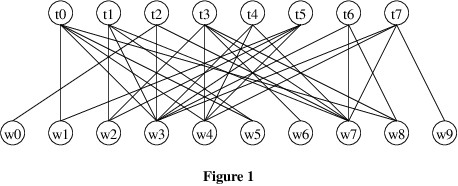
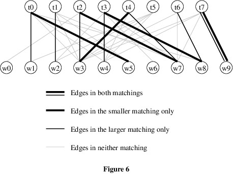

# Homework Assignment 6: Revised Task Scheduler

For this assignment, you will improve the solution to Homework Assignment 2 by doing a better job of balancing the workload.

## 0. Contents

[TOC]

## 1. User Requirements

After using the program you wrote for Homework Assignment 2, the organization now would like the following modifications made:

- Some users of the earlier version report that it sometimes will produce a schedule with a very unbalanced workload. They want it to do a better job of balancing the workload.
- Workers are to be restricted from being assigned more than one task in a single day. If this restriction makes it impossible to assign workers to all tasks, some tasks will be left unassigned for that day.

## 2. Starting the Assignment

Create a GitHub repository using the link provided in Canvas, and clone it to your local machine. This repository contains the model solution to Homework 2 with the **Ksu.Cis300.LinkedListLibrary** project from the model solution to Lab Assignment 11 and the **Ksu.Cis300.Graphs** project from the model solution to Lab Assignment 35 added. The files in the **Data** folder have been replaced by different input files.

## 3. User Interface

The GUI should remain unchanged. The only differences in functionality are that the schedules produced will tend to balance the load better, and that workers will never be assigned to more than one task in a single day. Because the user interaction is unchanged, no demo video will be provided.

## 4. Bipartite Matching

The solution strategy you will use is to model the problem as an instance *bipartite matching*. A *bipartite graph* is an undirected graph whose nodes are partitioned into two disjoint sets, and whose edges each connect a node from one of the sets to a node in the other set. For this problem, the nodes are the workers and the tasks, and the edges connect a worker with a task if that worker is qualified to do that task. For example, Figure 1 shows a bipartite graph for an instance with 10 workers and 8 tasks:

In the above instance, worker w0 is qualified only for task t2, w1 is qualified for t0 and t5, etc.

A *matching* in a bipartite graph is a subset of the edges in which no two edges meet at the same node. For example, a matching for the graph in Figure 1 is shown in Figure 2 below.

Our goal is to find a matching of maximum size. Such a matching gives an assignment of workers to tasks, maximizing the number of tasks filled (or equivalently, the number of workers assigned.)

### 4.1. Augmenting Paths

Central to the bipartite matching algorithm is the notion of an *augmenting path*. Given a matching, an augmenting path for that matching is a path that:

- starts at an unmatched worker node;
- always uses an edge in the matching in going from a task node to a worker node; and
- ends at an unmatched task node.

For example, Figure 3 below shows an augmenting path (i.e., w5-t1-w2-t3-w4-t5) for the matching from Figure 2.

Because the edges in a bipartite graph each connect a worker node to a task node, any path will alternate between worker nodes and task nodes. Thus, every second edge in an augmenting path will come from the matching, but no other edge will. As a result, each node except the first and last in an augmenting path will be connected to one edge from the matching and one edge from the augmenting path, but not in the matching. Finally, because the path begins with a worker node and ends with a task node, the path will always contain one more edge that is not from the matching than edges that are from the matching. We can therefore obtain a larger matching by removing the edges that are in both the augmenting path and the matching, and adding the other edges from the augmenting path:

We therefore have the following facts about augmenting paths:

***Fact 1:*** *When we augment a matching using an augmenting path, the size of the matching increases by 1.*

***Fact 2:*** *When we augment a matching using an augmenting path, all nodes in the original matching are in the resulting matching (possibly matched with different nodes).*

### 4.2. When Augmenting Paths Exist

We can learn a lot about augmenting paths by seeing what happens when we combine two matchings of different sizes. Consider, for example, the matching shown in Figure 5 below.

If we combine this matching with the larger matching from Figure 2, we obtain the following:

Because the edges come from two matchings, each node can be on at most two of these edges. These edges can therefore be partitioned into paths, with no two paths having nodes in common. These paths are of the following types:

1. Paths such as w9-t7, which are formed by a single edge belonging to both matchings. Because such an edge belongs to both matchings, it cannot be connected to any other edges from either matching.
2. Cycles such as w3-t4-w7-t2-w3. Because edges alternate between the two matchings, these cycles contain the same number of edges from both matchings.
3. Non-cyclic even-length paths such as w1-t0-w5. Because edges alternate between the two matchings, these paths also contain the same number of edges from both matchings.
4. Odd-length paths such as w4-t3-w8-t6. Because edges alternate between the two matchings, these paths contain one more edge from one matching than from the other. Each of these is therefore an augmenting path for the matching with fewer edges on the path.

Because the two matchings are of different sizes and each edge from either matching occurs in exactly one path, there must always be some path containing more edges from the larger matching than from the smaller matching; i.e., there must be a type-4 path with more edges from the larger matching. Such a path is an augmenting path for the smaller matching. We therefore have the following additional fact:

***Fact 3:*** *If a matching is not of maximum size, it has an augmenting path.*

Finally, consider what happens if the nodes in the smaller matching all belong to the larger matching, as in Figure 7 below (t2, t3, t4, t7, w3, w7, w8, and w9 belong to both matchings, and t0, t1, t6, w1, w2, and w4 belong to the larger matching only).

Let *w* be a worker node that is in the larger matching but not the smaller matching (for example, let *w* be w4). Then *w* begins a non-cyclic path that starts with an edge from the larger matching. Because edges in the path alternate between the matchings, any time this path enters another worker node, it does so via an edge from the smaller matching. Because each node in the smaller matching is also in the larger matching, this path cannot end at a worker node - it continues via an edge from the larger matching. The end of this path must therefore be at a task node. Hence, this path is an augmenting path for the smaller matching. This gives us the following fact:

***Fact 4:*** *Let* M *be any matching, and let* w *be a worker node. Suppose that* w *is not in* M*. If there is a matching containing all the nodes of* M*, as well as* w*, then* M *has an augmenting path from* w*.*

### 4.3. The Matching Algorithm

Based on the four facts derived above, we can now give an algorithm for finding a maximum-sized matching, while attempting to balance the workload of the workers. The overall strategy is to begin with an empty matching, then increase its size by finding augmenting paths. 

To find an augmenting path from a given worker node, we can use breadth-first search (see Lab 34) with the following modifications:

- Whenever we reach a matched task node, instead of enqueuing all outgoing edges, we follow the edge to the matched node and enqueue all of the outgoing edges from its destination. Essentially, instead of processing edges one at a time, we are processing them in pairs - an edge from a worker to a task, followed by an edge in the matching leading to a worker. Both of these edges need to be recorded in the dictionary storing the path information. Proceeding in this way, the queue will only contain edges from the workers to tasks. 
- If we reach an unmatched task node, we have found an augmenting path. 

For each augmenting path we find, we augment the matching as described in the [Section 4.1. Augmenting Paths](#4.1. Augmenting Paths). Specifically, because the above algorithm for finding an augmenting path is based on breadth-first search, it builds a dictionary storing the path information it collects. This dictionary gives the predecessor of each node, starting with the end of the augmenting path (a task node) and ending at the start of the path (a worker node). We can therefore iterate through this path two nodes at a time, and each iteration except the last will take us to another task node (because the predecessor of the start node is itself, this process will end at the start node, which is a worker). On each iteration, we therefore match the current task node to its predecessor (a worker node). By Fact 1, this increases the size of the matching by 1. 

As we search for augmenting paths, there is no need to start searching from any node more than once - if we find an augmenting path, this node will remain matched (Fact 2), and if we don't find one, no augmenting path will subsequently exist from this node (Facts 2 and 4). In order to try to achieve the desired balance, it therefore makes sense to consider the worker nodes in order of the number of times they have been scheduled. 

The complete matching algorithm therefore is as follows:

1. Sort the workers by the number of times each node has been scheduled.
2. For each worker node:

   <ol type="a"><li>If the number of pairs in the current matching is as large as either the number of workers or the number of tasks, return this matching.</li><li>Look for an augmenting path using the modified breadth-first search described above.</li><li>If an augmenting path is found, use it to augment the current matching, as described above.</li></ol>

Note that this algorithm does not necessarily give a schedule that is perfectly balanced. In fact, it sometimes can produce schedules that are less balanced than those produced by the solution to Homework 2. However, it does a good job of avoiding very poorly-balanced schedules.

## 5. Software Architecture

The **Ksu.Cis300.Scheduler** namespace should contain five classes, as shown in the following class diagram:

The **WorkerQueue** and **DoublyLinkedListCell** classes from Homework Assignment 2 will not be used - you can remove them if they get in the way. You will need to make changes to the **UserInterface**, **Schedule**, **ScheduleIO**, and **Worker** classes, including renaming **Worker** to **Node**. The **TimesScheduledComparer** will be used to define how comparisons are done when sorting an array or list of **Node**s. The **ScheduleLengthDialog** class won't need to be changed.

You will not need to make any changes to the **Ksu.Cis300.Graphs** or **Ksu.Cis300.LinkedListLibrary** namespaces. The types defined in these namespaces are not shown in the class diagram above.

## 6. Data Structures

This section discusses the major data structures your program will use. The code you will need to write to use these data structures is described in [Section 7 Coding Requirements](#7-coding-requirements) below.

### 6.1. The Bipartite Graph

You will store the workers' qualification information in a **DirectedGraph\<Node, bool\>**. You will not need to store any edge data, but a type parameter for the edge data is required. Because **bool** is a small type, it makes sense to use this type for the edge data. If a worker *w* is qualified for a task *t*, the graph should contain an edge from *w* to *t*. The data on these edges can be either **true** or **false** - it makes no difference which, as this data will not be used. Edges from tasks to workers don't need to be included because the modified breadth-first search uses edges from a matching to get from tasks to workers.

### 6.2. Dictionaries

Several dictionaries will also be used in this program. Because the algorithm for finding an augmenting path is a modification of breadth-first search, it will use a **Dictionary\<Node, Node\>** to store the path information. Matchings will also be stored in **Dictionary\<Node, Node\>**s. Keys in these dictionaries will be matched task nodes, and the associated values for each key will be the worker node to which it is matched. 

We use dictionaries because they provide quick lookups and can be modified quickly. Don't embarrass yourself by using a loop to look up a key - use indexing or the **ContainsKey** or **TryGetValue** method instead, whichever is appropriate. Iterate through a dictionary only when you need to process all keys and/or values in the dictionary.

## 7. Coding Requirements

Specific coding requirements for all classes in the **Ksu.Cis300.Scheduler** project are given in what follows. In order for the unit tests to compile, you will need to use the same names for **public** members as those shown in the class diagram. Be sure to follow the [naming conventions](https://cis300.cs.ksu.edu/appendix/style/naming/) for **private** members. In some cases, you are required to break the code into more **private** methods than what are described. You may include even more **private** methods if you believe that improves the code.

### 7.1. The Node Class

Rename your **Worker** class to **Node**, as it will now be used as any node in the graph - either a worker or a task. You will no longer need the `_qualifications` field or the **IsQualified** method, as this information will be stored elsewhere. 

Modify the constructor so that it takes as its parameter a single **string** (i.e., not an array) giving the name of the worker/task, and remove all initialization code for `_qualifications`. Also remove the code that checks the length of this parameter.

### 7.2. The TimesScheduledComparer Class

This class should implement the **IComparer\<Node\>** interface. The only member it needs is the [**Compare**](https://learn.microsoft.com/en-us/dotnet/api/system.collections.generic.icomparer-1.compare?view=net-6.0) method required by the interface. This method should take two **Node**s as its parameters. If either **Node** is **null**, throw an **ArgumentNullException**. Otherwise, compare their **TimesScheduled** properties using one of these **int**s' **CompareTo** methods. The result of this call should be returned. Be sure to compare the **TimesScheduled** in the same order as the **Node**s are provided in the parameter list.

### 7.3. The Schedule Class

You will need to add a **private static readonly TimesScheduledComparer** field, initialized to a new instance, to use for sorting the workers by their times scheduled. You will also need to modify the constructor and the two **private** methods and add at least three more **private** methods. The modifications to the constructor and the two provided methods are described in what follows.

#### 7.3.1. A method to initialize the number of times each given node has been scheduled

You can modify the the **GetQueue** method to do this. You should rename it to reflect its changed functionality. It should return nothing - all references to a **WorkerQueue** should be removed.

#### 7.3.2. The GetOneDay method

The parameters to this method should be changed as follows:

- Instead of a **WorkerQueue**, provide the workers in a **Node[&nbsp;]**.
- Instead of an **int** giving the number of tasks, provide the tasks in a **Node[&nbsp;]**.
- Also include a **DirectedGraph\<Node, bool\>** giving the bipartite graph of qualifications.

After initializing the **string[&nbsp;]**, get a maximum-sized matching for the graph using the algorithm given in [Section 4.3. The Matching Algorithm](#4.3. The Matching Algorithm). To sort the array of workers, use the [**Array.Sort**](https://learn.microsoft.com/en-us/dotnet/api/system.array.sort?view=net-6.0#system-array-sort(system-array-system-collections-icomparer)) method, passing the **TimesScheduledComparer** field as the second parameter. 

After a maximum-sized matching has been found, modify the provided loop so that for each location in the array of tasks, the matching is used to determine whether a worker was scheduled for that task, and if so, which worker is scheduled.

#### 7.3.3. The constructor

You will need to change the constructor's parameter list as follows:

- Instead of a **Worker[&nbsp;]**, provided the workers in a **Node[&nbsp;]**.
- Instead of an **int** giving the number of tasks, provide the tasks in a **Node[&nbsp;]**.
- Leave the **int** giving the length of the schedule unchanged.
- Also include, as the last parameter, a **DirectedGraph\<Node, bool\>** giving the bipartite graph of qualifications.

If either **Node[&nbsp;]** or the graph is **null**, throw an **ArgumentNullException**. If either of the arrays contains a **null** value or a node that is not contained within the graph, throw an **ArgumentException**. The only other changes you will need to make are to update the calls to the above methods to agree with the changes you made to these methods.

### 7.4. The ScheduleIO Class

You will need to modify both **public** methods and add at least two **private** methods.  The modifications to the **public** methods are described in what follows.

#### 7.4.1. The **ReadInput** method

You will need to modify this  method as follows:

- Change the return type to be a tuple of two **Node[&nbsp;]**s. These will be the task nodes (not just the task names) and the worker nodes.
- Include as a second parameter an **out** parameter of type **DirectedGraph\<Node, bool\>**. This will be the bipartite graph of qualifications.
- Instead of building a **string[&nbsp;]** containing the task names, it should build a **Node[&nbsp;]** containing the task nodes. Each of these nodes should be added to the bipartite graph. 
- Instead of building a **WorkerQueue**, it should build a **Node[&nbsp;]** containing the worker nodes. It should also add all of these nodes and all of their outgoing edges to the bipartite graph. 

#### 7.4.2. The **WriteOutput** method

You will need to change the type of the second parameter to **Node[&nbsp;]**.  Then you will need to update the remainder of the method to reflect this change.

### 7.5. The UserInterface Class

You will need to modify the `_tasks` field to be of type **Node[&nbsp;]**. You will also need to add a **private** field of type **DirectedGraph\<Node, bool\>** to store the bipartite graph of qualifications. Initialize this field to a new instance to avoid the need to make it nullable.

In addition, you will need to modify the code to reflect these changes to the fields and the changes to how **public** members of other classes are called. Syntax errors in your code should indicate where changes need to be made. Note that you will need to use the bipartite graph to determine whether a worker is qualified for a task.

## 8. Performance and Testing

Unit tests have been provided to test the **Node**, **TimesScheduledComparer**, and **Schedule** classes. You should first work on getting the provided unit tests to pass. Group the tests first by class, then by trait, and work through them alphabetically within these groupings.

The unit tests do **not** test the **ScheduleIO** or **UserInterface** classes. You will therefore need to do some interactive testing. Below are several specific tests you should run using input files from the **Data** folder. Be sure each matching is valid (i.e., that no worker is assigned more than one task in a given day). The performance should be only slightly slower than the performance of the model solution to Homework 2.

- **data1.csv**: This is the data set shown in Figure 1 above and used in the unit test **TestLargeGraph** in the class **CScheduleTests**. A 10-day schedule should schedule each worker 8 times, whereas the model solution to Homework Assignment 2 produces a schedule in which each worker is scheduled 5-9 times. Check that this schedule can be correctly saved to a file.
- **data2.csv**: A 100-day schedule should schedule each worker 90 times, whereas the model solution to Homework Assignment 2 produces a schedule in which each worker is scheduled 50-95 times. 
- **data3.csv**: This data set should result in a worker being scheduled 0 times for any length of schedule (one worker is qualified for no tasks).
- **data4.csv**: This file contains a task T3 with no qualified workers; hence, this task will never be assigned a worker.
- **data5.csv**: This data set has 50 tasks and 100 workers. Set the schedule length to 100. It should generate a schedule in which each worker is scheduled 50 times.
- **no-workers.csv**: This file contains tasks, but no workers. It should throw an **IOException** containing the message, "The file doesn't have enough lines."
- **uneven-lines.csv**: This lines of this file contain different numbers of fields. It should throw an **IOException** containing the message, "Line 4 contains the wrong number of fields."

## 9. Submitting Your Assignment

Be sure to **commit** all your changes, then **push** your commits to your GitHub repository. Make sure the **Ksu.Cis300.Scheduler** folder in your repository contains all nine .cs files, as we can only grade what is present in the repository. Then submit the _entire URL_ of the commit that you want graded. 

**Note:** The repositories for the homework assignments for this class are set up to use GitHub's autograding feature to track push times. No actual testing/grading is done, but after each push, the GitHub page for the repository will show a green check mark on the line indicating the latest commit. Clicking that check mark will display a popup indicating that all checks have passed, regardless of whether your program works. You may also get an email indicating that all checks have passed. The only purpose for using the autograding feature in this way is to give us a backup indication of your push times in case you submitted your assignment incorrectly.
